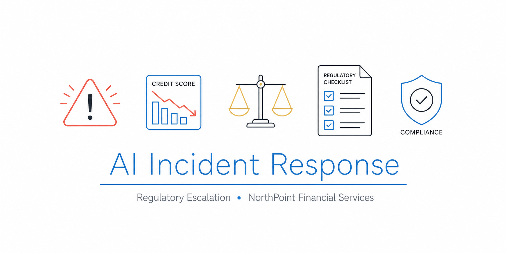

<div align="center">

<!-- BANNER PROMPT (ChatGPT / Google Flow):
Professional banner for a GitHub repository about AI incident response and regulatory escalation in financial services.
Style: flat 2D vector icons, dark navy background (#0d1117 or similar), clean sans-serif font.
Icons to include: warning/alert triangle with exclamation mark, credit score graph with downward trend arrow, balance scales (fairness/justice), regulatory checklist document, shield with compliance mark.
Text overlay: "AI Incident Response" in white bold, subtitle "Regulatory Escalation · NorthPoint Financial Services" in smaller lighter text below.
Dimensions: 1280x640px. No 3D, no gradients, no cartoon style.
-->


# 🚨 AI Incident Response and Regulatory Escalation

# NorthPoint Financial Services

[](https://artificialintelligenceact.eu/)
[](https://airc.nist.gov/)
[](https://www.iso.org/standard/81230.html)
[](https://www.fca.org.uk/firms/consumer-duty)
[](https://www.legislation.gov.uk/ukpga/2010/15/contents)
[]()

**Phase 4 of an end-to-end AI Governance Programme**

[← Phase 1: AI System Inventory](https://github.com/franciscovfonseca/AI-System-Inventory) · [← Phase 2: AI Risk Assessment](https://github.com/franciscovfonseca/AI-Risk-Assessment) · [← Phase 3: Responsible AI Policy](https://github.com/franciscovfonseca/AI-Governance-Policy) · **Phase 4: AI Incident Response** · Phase 5: Coming Soon

</div>

---

---

## Executive Summary

Two months after NorthPoint Financial Services implemented its Responsible AI Policy and Governance Framework, an internal bias audit uncovers a critical finding: the NP-001 Credit Scoring Engine has been systematically assigning lower credit scores to loan applicants from London postcodes that correlate with concentrations of ethnic minority communities. The disparity is statistically significant, cannot be explained by creditworthiness differences and has been active since the model was deployed in 2022.

This is not a risk on paper. It is a live incident affecting real applicants. Affected individuals face higher rejection rates, inflated interest rates and diminished credit access - outcomes that constitute indirect discrimination under the UK Equality Act 2010. The incident triggers obligations to notify the FCA and the ICO, and requires immediate decisions about model suspension, customer communication and regulatory disclosure.

Phase 4 documents how a well-prepared governance team responds: containing the harm quickly, conducting a structured investigation, engaging regulators transparently, remediating affected customers and fixing the root cause. It demonstrates that AI governance is not a point-in-time compliance exercise - it is tested most rigorously when something goes wrong, and the quality of the response determines whether a governance failure becomes a manageable problem or a regulatory crisis.

---

## What This Project Demonstrates

- How to structure an **end-to-end AI incident response** - from initial detection and containment through regulatory notification, customer remediation and model redeployment
- Practical application of the **NIST AI RMF Manage function** to a live AI fairness failure in a high-risk financial services system
- Knowledge of **regulatory escalation obligations** under the EU AI Act (Article 73), FCA Consumer Duty and UK GDPR
- Application of the **5 Whys method** to trace a bias failure back to its systemic governance root cause
- Understanding that **governance gaps in production systems already deployed** are as significant as risks in new deployments

---

## Incident Overview

| | |
|---|---|
| **Incident ID** | NP-INC-2026-001 |
| **System** | NP-001 · Credit Scoring Engine |
| **Incident type** | AI Fairness / Discriminatory Output |
| **Severity** | 1 - Critical |
| **Detected** | 10 March 2026 |
| **Closed** | 12 June 2026 |
| **Duration** | 95 days |

The Credit Scoring Engine uses postcode as a geographic risk feature. In 12 London postcode districts with above-average concentrations of Black British and South Asian residents, this feature acts as a statistically significant proxy for race and ethnicity. Affected applicants receive scores 35-55 points lower on average than comparably creditworthy applicants from other postcodes - translating to a 12-percentage-point increase in rejection rates and approximately £2.1 million in excess interest charged to affected approved accounts.

---

## Artefacts

| File | Description |
|---|---|
| [`docs/incident-scenario.md`](docs/incident-scenario.md) | Incident description, detection narrative, scope assessment and initial severity classification |
| [`docs/incident-response-timeline.md`](docs/incident-response-timeline.md) | Week-by-week incident response and remediation timeline (March - June 2026) |
| [`docs/root-cause-analysis.md`](docs/root-cause-analysis.md) | 5 Whys root cause analysis, contributing factors, corrective action plan and lessons learned |

---

## NorthPoint Programme Context

This project is Phase 4 of the NorthPoint Financial Services AI Governance Programme - a five-phase portfolio demonstrating end-to-end AI governance capability for a regulated financial services organisation.

| Phase | Project | Focus |
|---|---|---|
| 1 | [AI System Inventory](https://github.com/franciscovfonseca/AI-System-Inventory) | Identifying and classifying AI systems across the organisation |
| 2 | [AI Risk Assessment](https://github.com/franciscovfonseca/AI-Risk-Assessment) | Assessing risk for high-risk AI systems including NP-001 |
| 3 | [Responsible AI Policy and Governance Framework](https://github.com/franciscovfonseca/AI-Governance-Policy) | Establishing governance structures, policies and accountability |
| **4** | **AI Incident Response** (this project) | **Responding to an AI failure and fulfilling regulatory obligations** |
| 5 | High-Risk AI Documentation | Producing compliant technical documentation under the EU AI Act |

The bias audit that detected this incident was conducted as part of the governance programme established in Phase 3. This is governance working as intended - and demonstrating that even with a framework in place, production systems require active, ongoing monitoring.

---

## Framework Alignment

| Deliverable | EU AI Act | NIST AI RMF | ISO 42001 | FCA Consumer Duty |
|---|---|---|---|---|
| Incident detection and classification | Art. 9 (ongoing risk management) | MANAGE 2.2 (incident response) | 6.1.2 (AI risk treatment) | Outcome 1 (products meet customer needs) |
| Regulatory notification | Art. 73 (serious incident reporting) | GOVERN 1.7 (accountability) | 9.1 (monitoring and measurement) | Principle 11 (relations with regulators) |
| Customer remediation | Art. 13, 14 (transparency, human oversight) | MANAGE 3.2 (remediation) | 10.1 (continual improvement) | Outcome 2 (fair value) |
| Root cause analysis | Art. 9, 17 (risk management, post-market monitoring) | MANAGE 4.1 (lessons learned) | 10.2 (nonconformity and corrective action) | Principle 6 (customers' interests) |

---

## Why Incident Response Capability Matters

AI incidents involving discriminatory outputs, privacy breaches and unexplained automated decisions are already producing regulatory action and litigation across the financial services sector. The UK FCA has identified algorithmic bias and model risk in credit decisioning as areas of active supervisory concern.

The EU AI Act establishes obligations for the entire operational lifecycle of high-risk AI systems, not just pre-deployment:

- **Article 9** - Ongoing risk management throughout the system's lifecycle
- **Article 12** - Logging and traceability requirements for high-risk systems
- **Article 17** - Post-market monitoring obligations
- **Article 73** - Reporting of serious incidents to national competent authorities

Under **FCA Consumer Duty** (effective July 2023), firms must demonstrate that their products and services deliver good outcomes for all customers, including those with protected characteristics. A systematically biased AI system producing discriminatory lending decisions constitutes a direct Consumer Duty failure. Firms are expected to identify and remediate such failures proactively - not wait for customers to complain.

Under the **UK Equality Act 2010**, indirect discrimination in the provision of financial services on grounds of race is unlawful regardless of intent. A model feature that acts as an ethnicity proxy produces unlawful indirect discrimination even if no discriminatory purpose existed.

---

## Repository Structure

```
AI-Incident-Response/
├── README.md
└── docs/
    ├── banner.png
    ├── incident-scenario.md
    ├── incident-response-timeline.md
    └── root-cause-analysis.md
```

---

## How to Navigate This Repository

Start with [**incident-scenario.md**](docs/incident-scenario.md) for the incident description, detection narrative and initial severity assessment.

Read [**incident-response-timeline.md**](docs/incident-response-timeline.md) for the week-by-week response - containment decisions, regulatory notifications, customer impact quantification and model remediation.

Finish with [**root-cause-analysis.md**](docs/root-cause-analysis.md) for the 5 Whys analysis, contributing factors and the corrective actions taken to prevent recurrence.

---

*Part of the NorthPoint Financial Services AI Governance Programme. This is a simulated scenario for portfolio and training purposes.*
